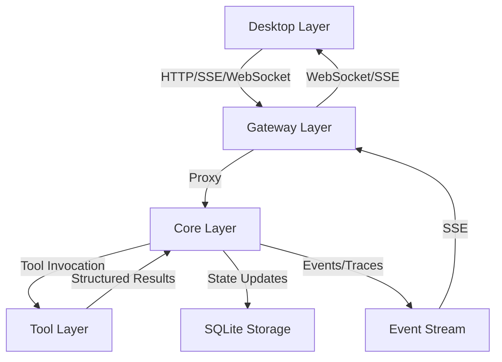

# PROJECT KNOWLEDGE BASE

**Generated:** 2026-05-30
**Generated By:** openai/gpt-5.5
**Last Updated:** 2026-07-15
**Last Updated By:** Codex (upstream icon conflict resolution)
**Last Verified Commit:** 312cad4
**Branch:** main

## AI MAINTENANCE PROTOCOL
- Treat this file and nested `AGENTS.md` files as living project memory, not static docs.
- Before relying on a rule that looks stale, contradictory, or surprising, verify against source files, configs, scripts, and docs.
- If verified reality differs from this file, update the relevant `AGENTS.md` immediately in the same change.
- When changing code, configs, commands, ports, contracts, module boundaries, or build/test workflows, update affected `AGENTS.md` files in the same work item.
- When modifying any `AGENTS.md`, update the metadata above: `Last Updated`, `Last Updated By`, `Last Verified Commit`, and `Branch`.
- Do not “fix” this file from memory alone; cite current repo evidence in the edit rationale or final message.
- Keep entries concise and project-specific. Remove obsolete guidance instead of appending conflicting notes.

## OVERVIEW
TinadecOffice is a Windows-first intelligent agent desktop workbench built around a universal agent harness. The target product combines a .NET Core state/runtime service, an Elysia TypeScript Gateway, and an Electron + Vue desktop UI under one npm workspace root. The Core implementation is currently being rebuilt.

## CURRENT REBUILD STATE
- On 2026-07-15 the TinadecCore skeleton was rebuilt as a .NET 10 modular monolith based on Microsoft Agent Framework (MAF) 1.13.0.
- `TinadecCore/` now contains 13 source projects (Contracts, Abstractions, Strategies F#, DmaEA, Models, Context, Prompts, Memory, Skills, LoopGuard, Lifecycle, Runtime, Api) and 3 test projects (Architecture, AgentFramework, Api).
- All 16 Core projects build and 26 Core tests pass. Root solution `TinadecOffice.slnx` builds successfully (19 projects total).
- Three fully implemented endpoints + ~70 Gateway proxy stubs are live: `GET /api/v1/health`, `GET /api/v1/harness/manifest`, `GET /api/v1/readiness` (port 48731). All Gateway-proxied GET endpoints return 200 with empty collections; write endpoints return 501. Gateway BFF composition (`model-center/overview`, `agent-center/overview`) works end-to-end.
- `package.json` `dev:core` now targets `TinadecCore/Api/TinadecCore.Api.csproj`.
- The former `gateway/` tree is currently present as `TinadecGateway/`. Root `dev:gateway` script uses `cd TinadecGateway`.
- Commit `57fb696` remains the verified pre-deletion baseline for legacy implementation details.
- Legacy Core/Contracts test projects (`tests/TinadecCore.Tests`, `tests/Tinadec.Contracts.Tests`) are preserved as requirements evidence but removed from the active solution.
- Skeleton + Gateway stubs: no SQLite schema, no real provider calls, no vector store, no full dual-layer runtime. Stub endpoints allow Gateway/Desktop to function without crashes. See `TinadecCore/AGENTS.md` for details.

## THREE-LAYER ARCHITECTURE

TinadecOffice采用三层架构设计，每层有明确的职责边界和技术栈：

### Desktop层 (UI呈现层)
- **技术栈**: Electron + Vue 3 + Vite + Tailwind CSS
- **端口**: 5173 (Vite开发服务器)
- **主要职责**: 
  - 提供聊天界面、任务图、执行分派、上下文包、监督发现、审批和事件流
  - 包含Agent Debug Studio调试工具
  - 支持可分离的面板窗口
  - 通过HTTP/SSE/WebSocket与Gateway通信
- **关键组件**: 
  - Monaco Editor: 代码编辑器
  - Xterm.js: 终端模拟器
  - Node-pty: 伪终端支持
- **设计原则**: 只调用Gateway，不直接调用Core；不存储任何业务状态

### Gateway层 (BFF/API层)
- **技术栈**: Elysia TypeScript + Node.js
- **端口**: 48730
- **主要职责**: 
  - 作为Desktop和Core之间的代理层
  - 提供RESTful API端点（`/api/v1/*`）
  - 代理所有请求到Core层
  - 处理CORS和API文档（Swagger）
- **关键组件**: 
  - `codeTools.ts`: 代码工具执行
  - `coreClient.ts`: Gateway到Core的HTTP/SSE调用
  - `mcpRoutes.ts`: MCP协议支持
- **设计原则**: 薄代理模式，不存储任何状态；只代理请求，不实现业务逻辑

### Core层 (智能体编排层)
- **技术栈**: .NET 10 C# + ASP.NET Core
- **端口**: 48731
- **当前状态**: 旧实现已删除；根级 `TinadecCore/` 为空，等待重建
- **主要职责**: 
  - **唯一状态权威**: 管理会话、消息、项目、事件、审批等所有状态
  - **双层智能体编排**: Planning layer（主动规划与监督）和Execution layer（被动执行任务）
  - **工具执行与审批**: 通过审批门机制控制写操作
  - **模型路由**: 管理模型provider、route和settings
  - **持久化**: SQLite存储所有状态
  - **可观测性**: OpenTelemetry集成
- **重建必须覆盖的能力**: 状态存储、编排、工具注册与审批、harness清单、运行时/模型/工具层就绪回执、事件和追踪
- **设计原则**: 通用智能体编排模型，可被其他产品复用；通过接口治理工具，不硬编码工具逻辑

### TinadecTools (原型工具层)
- **技术栈**: .NET 10 C# + System.Text.Json source generation + official `ModelContextProtocol` SDK
- **作用**: 作为静态/非静态工具处理器的原型宿主，验证 AOT-safe JSON 与工具注册方式
- **注册方式**: 静态工具使用 `[ToolFunction(...)]` + source generator 生成注册表，可用 `RequiresApproval = true` 标记写工具；需要状态的工具可继承 `ToolHandlerBase<TArgs, TResult>` 并手动注册
- **MCP-Pass-Through**: `Tools/Mcp` 独立实现 `mcp_list`、`mcp_search`、`mcp_invoke`，从启动目录 `mcp_servers.json` 或 `TINADEC_TOOLS_MCP_CONFIG` 读取 stdio MCP server 配置；`mcp_invoke` 需要审批
- **边界**: 这里的 generator 只负责编译期生成静态注册代码，不承担 Core 层状态、审批或路由职责

## LAYER INTERACTION AND DATA FLOW

### 典型用户请求流程
1. 用户在Desktop发起目标、选择项目、配置模式或审批动作
2. Desktop调用Gateway（端口48730）
3. Gateway代理请求到Core（端口48731）
4. Core创建或更新会话状态，生成run、task graph、agent assignment、context pack和supervision finding
5. Core根据工具描述和权限策略决定哪些只读工具可自动执行，哪些必须进入审批流程
6. Core通过工具适配器请求Tool layer
7. Tool layer调用对应工具实现，返回结构化结果
8. Core将结果写回step result、event、trace和状态存储
9. Desktop通过HTTP/SSE/WebSocket刷新UI

### 数据流向图


### 核心设计原则
1. **Core是唯一状态权威**: Gateway和Desktop不存储任何状态
2. **Desktop只调Gateway**: 不直接调用Core
3. **Code是Tool Layer内置工具套件**: 不是独立层
4. **审批门机制控制写操作**: 任何mutating action都必须经过审批
5. **API契约统一snake_case**: 所有API使用snake_case命名
6. **Windows优先**: 针对Windows平台优化

## SURVIVING COMPONENTS AND REBUILD INPUTS

### Gateway层关键组件
- **Elysia App** (`TinadecGateway/src/index.ts`): 主应用入口，定义所有API路由
- **coreClient** (`TinadecGateway/src/coreClient.ts`): Gateway到Core的HTTP/SSE调用客户端
- **codeTools** (`TinadecGateway/src/codeTools.ts`): 代码工具执行，发布Code工具规格和执行
- **mcpRoutes** (`TinadecGateway/src/mcp/mcpRoutes.ts`): MCP协议支持，处理Model Context Protocol请求
- **debugProxy** (`TinadecGateway/src/debugProxy.ts`): 调试代理，转发Debug Studio相关请求

### Desktop层关键组件
- **Electron Main** (`apps/desktop/electron/main.cjs`): Electron主进程，管理窗口和IPC
- **Panel Window** (`apps/desktop/electron/panelWindow.cjs`): 面板窗口管理，支持可分离的面板窗口
- **Terminal Manager** (`apps/desktop/electron/terminalManager.cjs`): 终端管理器，处理终端IPC
- **API Client** (`apps/desktop/src/api.ts`): API客户端，封装与Gateway的通信
- **Tool Catalog** (`apps/desktop/src/toolCatalog.ts`): 工具目录，组织Code工具套件和设置UI
- **Theme Composable** (`apps/desktop/src/composables/useTheme.ts`): 主题管理，处理主题和强调色持久化

### Tool层关键组件
- **TinadecTools** (`TinadecTools/`): 审批感知的文件、命令、Git、MCP 原型工具宿主，仍然存在。
- **Source Generator** (`TinadecTools.Generators/`): `[ToolFunction]` 静态注册表生成器，仍然存在。

### 删除前的旧 Core 轮廓
- 旧 `src/` 共 75 个受跟踪文件：Core 43、Contracts 5、Model 27；另有 130 个 `bin`/`obj`/`output` 产物随目录清理。
- 旧 HTTP 面覆盖 health/doctor/readiness、project/session/message、run/task/context/supervision、tool execution/approval、model provider/route/settings、market/extensions、MCP/ACP、agent/prompt evolution、debug/simulation。
- 旧 Core 采用 ASP.NET minimal API + SQLite + OpenTelemetry；Contracts 集中 DTO/event/security；Model 集中 provider runtime、routing、credentials、readiness 和 invocation。
- 这些是重建设计输入，不是必须照搬的目录或类结构。

## AI READING ORDER
Read these before making architecture, feature, or UI decisions:
1. `docs/agent-harness-product-model.zh-CN.md` or `docs/agent-harness-product-model.en.md` - product model and layer boundaries.
2. `docs/architecture.md` - current technical architecture, ports, event shape, and Debug Studio overview.
3. `docs/reference-project-map.md` - sibling-project reference map for VS Code, Codex, t3code, OpenCode, OpenHarness, Open-ClaudeCode, openclaw, pi, DeepSeek-TUI, The Zeroth Docs, and Tinadice.
4. Surviving Gateway/Desktop/TinadecTools source and tests that prove current behavior.
5. Legacy Core/contract tests as requirements evidence; they do not currently build.
6. Deleted implementation through `git show 57fb696:<path>` only when a concrete contract needs historical clarification.

Product model summary: `Core` is the universal agent orchestration model / reusable agent harness. `Tool layer` provides executable, approval-aware capabilities. `Code` is not a peer layer; it is a built-in code/project/developer-environment tool suite inside the Tool layer. `Desktop` is the UI presentation surface.

## STRUCTURE
```
TinadecOffice/
├── TinadecCore/            # MAF-based modular monolith (13 source + 3 test projects)
│   ├── Contracts/          # Pure C# DTOs — no MAF/ASP.NET/F# deps
│   ├── Abstractions/       # Port interfaces + ITinadecCoreBuilder
│   ├── Strategies/         # F# pure strategy kernels
│   ├── DmaEA/              # Dual-layer multi-agent collaboration
│   ├── Models/             # Provider instances, routing, readiness
│   ├── Context/            # ContextPack with evidence and token budget
│   ├── Prompts/            # Deterministic prompt assembly
│   ├── Memory/             # Session serialization, chat history, retention
│   ├── Skills/             # AgentSkillsProvider, SKILL.md
│   ├── LoopGuard/          # Loop detection, iteration limits, budget checks
│   ├── Lifecycle/          # Run/task/agent/tool/approval state and audit
│   ├── Runtime/            # Full composition: AddTinadecCore()
│   ├── Api/                # ASP.NET Core minimal API (port 48731)
│   └── tests/              # Architecture, AgentFramework, Api tests
├── apps/desktop/          # Electron + Vue renderer, Debug Studio UI
├── TinadecGateway/        # Elysia BFF/proxy
├── TinadecTools/          # Approval-aware tool prototype host
├── TinadecTools.Generators/ # Tool registry source generator
├── tests/                 # TinadecTools tests plus legacy Core/contract requirements (evidence only)
├── docs/                  # product model, architecture, security, startup runbook
└── TinadecOffice.slnx      # Root solution (19 projects: Core + Tools + Tools.Tests)
```
The legacy `src/` directory is intentionally absent.

## WHERE TO LOOK
| Task | Location | Notes |
|------|----------|-------|
| Product model / layer boundaries | `docs/agent-harness-product-model.zh-CN.md`, `docs/agent-harness-product-model.en.md` | Read first for Core / Tool layer / Code suite / Desktop responsibilities. |
| Sibling project references | `docs/reference-project-map.md` | Maps VS Code, Codex, t3code, OpenCode, OpenHarness, Open-ClaudeCode, openclaw, pi, DeepSeek-TUI, The Zeroth Docs, and Tinadice to TinadecOffice absorb/reject decisions. |
| Rebuild status | `CURRENT REBUILD STATE` in this file, `TinadecOffice.slnx`, `package.json` | Root full-stack commands are broken until missing Core projects and paths are replaced. |
| Core rebuild target | `TinadecCore/` | Empty local directory. Define the replacement structure before adding implementation. |
| Legacy Core contracts | `tests/TinadecCore.Tests`, `tests/Tinadec.Contracts.Tests`, `apps/desktop/src/api.ts`, `TinadecGateway/src/` | Use as requirements evidence; reconcile contradictions explicitly. |
| Deleted implementation | Git object paths under commit `57fb696` | Inspect narrowly with `git show`; do not bulk-restore by default. |
| API proxy/BFF | `TinadecGateway/src/index.ts`, `coreClient.ts`, `modelAgentCenter.ts` | Thin Core proxy plus stateless, secret-stripping center views and Tool-layer code-tool endpoints. |
| Desktop UI | `apps/desktop/src/pages`, `src/components`, `src/api.ts` | Renderer talks to Gateway. |
| Detachable panel windows | `apps/desktop/electron/panelWindow.cjs`, `apps/desktop/src/pages/DetachedPanelPage.vue`, `apps/desktop/src/composables/usePanelTabs.ts` | Electron multi-window management for sidebar panel tabs; supports detach/reattach, independent data loading, and window state persistence. |
| Debug Studio UI | `apps/desktop/src/debug` | Backend was deleted and must be redesigned/reimplemented. |
| Tool layer / Code suite | `TinadecTools`, `TinadecGateway/src/codeTools.ts` | Surviving execution prototypes; new Core must govern policy, approval, audit, and dispatch. |
| Tool layer UI | `apps/desktop/src/pages/SettingsPage.vue`, `apps/desktop/src/toolCatalog.ts` | Desktop presents Core-governed Code-suite tools and Codex primitives. |
| Prompt context requirements | `apps/desktop/src/pages/SettingsPage.vue`, legacy tests, Git history | New Core must own storage/assembly; Desktop remains presentation only. |
| Shared contract reconstruction | `apps/desktop/src/api.ts`, Gateway response handling, legacy contract tests | Define Core contracts first, then update mirrors. |
| Tests | `tests/TinadecCore.Tests`, `tests/Tinadec.Contracts.Tests`, `tests/TinadecTools.Tests`, app `*.test.ts` | xUnit, node:test, Vitest. |

## CODE MAP
| Symbol/File | Type | Location | Role |
|-------------|------|----------|------|
| Gateway `app` | Server | `TinadecGateway/src/index.ts` | `/api/v1/*` and `/docs` route surface. |
| Gateway `modelAgentCenter` | BFF adapter | `TinadecGateway/src/modelAgentCenter.ts` | Aggregates Core-owned model/agent resources, derives read-only legacy bindings, negotiates optional capability degradation, and validates reserved writes without persisting state. |
| `proxyJson` / `proxySse` | Bridge | `TinadecGateway/src/coreClient.ts` | Gateway-to-Core HTTP/SSE calls. |
| Gateway `codeTools` | Tool bridge | `TinadecGateway/src/codeTools.ts` | Publishes Code-suite tool specs and primitive execution/fallbacks. |
| Desktop `toolCatalog` | UI helper | `apps/desktop/src/toolCatalog.ts` | Groups Code-suite tools and derives runtime language support for Settings UI. |
| Desktop `api.ts` | DTO mirror | `apps/desktop/src/api.ts` | Renderer-side Core/Gateway response types. |
| `useTheme` | Composable | `apps/desktop/src/composables/useTheme.ts` | Theme/accent persistence and application. |
| `TinadecTools` | 原型工具宿主 | `TinadecTools/Program.cs` | 验证 AOT-safe JSON source generation、静态 `[ToolFunction]` 注册和非静态 handler 基类。 |
| `TinadecTools.Generators` | Source generator | `TinadecTools.Generators/ToolFunctionGenerator.cs` | 扫描 `[ToolFunction]` 并生成静态注册表代码。 |
| `TinadecTools MCP` | Tool suite | `TinadecTools/Tools/Mcp` | 基于 official `ModelContextProtocol` SDK 的独立 MCP pass-through 工具：list/search/invoke。 |

## CONVENTIONS
- npm is the package manager. `package.json` still declares `apps/*` and `gateway`, but the Gateway directory is currently `TinadecGateway/`; repair the workspace entry during rebuild.
- TypeScript is strict in both app packages. Desktop alias: `@/* -> src/*`.
- Gateway is ESM + `NodeNext`; Desktop is ESM + Vite/Vue + Tailwind.
- The replacement Core is expected to target `net10.0` with nullable and implicit usings enabled unless the rebuild explicitly changes the documented platform decision.
- Rebuilt Core HTTP JSON must use `snake_case`; keep Desktop DTO mirrors synchronized from Core-owned contracts.
- Prompt fragment storage and assembly must return to Core. Gateway may proxy and Desktop may manage/preview, but neither may reimplement prompt selection.
- The surviving Model Center contract expects Gateway's five-part overview: Core-owned suppliers, API/local connections, configured-only models, CLI runtimes, and ACP runtimes. Desktop presentation metadata must not become the executable catalog.
- The surviving Agent Center exposes legacy read-only runtime binding previews. Persistent per-agent binding semantics must be redesigned and owned by the new Core before writes are enabled.
- Full assembled prompt content should remain local to preview UI/API. Runtime events and tool results should contain ids/counts/warnings rather than full prompt text.
- Treat Tool layer capabilities as Core-governed tools. Code is a Tool-layer suite, not a separate orchestration layer.
- The legacy contract named `executor_git_manager` as the execution-layer Git Manager Subagent. If retained, all Git mutations must still execute through approved TinadecTools calls; `git_worktree_manager` is only a legacy compatibility name.
- `TinadecTools` 原型里的静态工具写 `[ToolFunction(...)]` + `static ValueTask<TResult> HandleAsync(TArgs args, CancellationToken ct)`；写工具可用 `[ToolFunction("id", RequiresApproval = true)]` 让 generated registry 拒绝未批准调用；非静态工具则通过 `ToolHandlerBase<TArgs, TResult>` 或显式 `ToolRegistry.Register(...)` 接入。
- `TinadecTools` MCP pass-through 只属于工具层原型，不依赖 Core/Gateway/Desktop。配置文件格式是 `{ "servers": [{ "id", "name", "command", "args", "env", "cwd" }] }`；默认读启动目录 `mcp_servers.json`，可用 `TINADEC_TOOLS_MCP_CONFIG` 覆盖。
- `TinadecTools` 的 `command_run` 始终需要审批；Windows 上通过本地 `TinadecSandbox` 账户执行，首次已批准调用可触发 UAC 初始化。工作区和单次显式授权目录以临时 ACL 授予，命令结束后撤销；持久授权写入工作区 `.tinadec/sandbox.json`（gitignored），环境变量只保存名称、不保存值。超时范围是 1 毫秒到 30 分钟，超时会终止 Job Object 进程树；网络和局域网绑定由宿主防火墙决定。
- `TinadecTools` 的完整只读 Git 工具面（状态、推送就绪、diff、日志/文件历史、分支/worktree/ref/remote、blame、revision 文件和冲突预览）都需要审批。它们只读取工作区内 Git 仓库；路径参数必须解析到仓库内且不得穿越 symbolic link 或 junction。补丁与文本输出受调用方字节预算限制，超限时返回显式 binary/truncation 元数据。
- `git_stage` 和 `git_unstage` 都需要审批。它们接受完整仓库内路径或受限 unified text patch（二者互斥）；patch 先进行仓库路径、文本类型和 `git apply --check` 校验，再只更新 Git index。二进制、rename、整文件新增/删除只能按完整路径处理。
- `git_commit` 需要审批和 `confirm_commit`。它要求 `commit_staged_only`、`include_all`、显式 `paths` 三种模式恰好选择一种；路径模式复用仓库/链接边界，成功结果返回 commit hash、实际 staged files 和最新 `git_status`。
- `git_checkout`、`git_branch_create`、`git_branch_delete`、`git_branch_rename` 都需要审批和各自的显式确认；分支名由 Git `check-ref-format --branch` 校验，删除当前分支会被工具层拒绝。
- `git_worktree_create` / `git_worktree_remove` 需要审批和显式确认，只管理工作区内 `.tinadec/worktrees/` 下的路径；该目录被 Git 忽略，创建可复用现有本地分支或从 `start_ref` 新建分支，删除当前 worktree 会被拒绝。
- `git_fetch`、`git_push`、`git_pull` 需要审批和显式确认。remote 必须是已配置名称；push 拒绝 dirty、detached 或 behind 状态并显式处理 upstream；pull 固定使用 `--ff-only`，不隐式 merge/rebase。
- `git_merge` 支持 start/continue/abort，`git_rebase` 支持 start/continue/abort/skip；均需要审批和显式确认，并通过禁用 editor 的 Git 配置保持非交互执行，冲突结果返回结构化 conflicted files 和最新 status。
- `git_conflict_preview` 与 `git_conflict_resolve` 共用无 AST 的行级三方文本合并引擎：从 base→ours/theirs 变更区间自动合并不相交、相同或单边修改，只报告真正重叠且不同的局部冲突。resolve 支持 `auto`、`ours`、`theirs`、`both`，解析后更新工作文件并 stage；binary 仅支持 ours/theirs。
- `TinadecTools` 文件工具在进程启动时将当前目录快照为唯一工作区根目录：相对路径以此解析，绝对路径必须在根目录内；读、写和 `file_search` 均拒绝经过 symbolic link 或 junction 的路径。`ls`/`stat` 可显示链接本身和 `link_target`，但不会读取目标。
- `write_file` 需要审批：仅当父目录已存在时才创建 UTF-8（无 BOM）LF 文件；覆盖既有文件必须提供匹配的 `file_hash`。既有 `replace_*`、`insert_*`、`delete_*` 工具不创建不存在的文件。
- The rebuilt Core must own `/api/v1/harness/manifest`, `/api/v1/tools/search`, `/api/v1/sessions/{sessionId}/tool-executions`, `/api/v1/readiness`, `/api/v1/model-readiness`, `/api/v1/model-catalog-readiness`, and `/api/v1/tool-layer-readiness` semantics. Gateway/Desktop may proxy or display these receipts but must not recompute them.
- Reserved dev ports remain Gateway `48730`, Core `48731`, Vite `5173`.
- When .NET scripts are repaired, continue clearing `Version` and `Ice-Version` for child dotnet processes on this machine.
- No repo ESLint, Prettier, or `.editorconfig` was found. Match local file style.

## PONYTAIL CODING PRINCIPLES

Before writing code, AI agents MUST follow this decision ladder:

1. **YAGNI Check**: Does this need to exist? → No: skip it
2. **Reuse Check**: Already in this codebase? → Reuse it, don't rewrite
3. **Stdlib Check**: Stdlib does it? → Use it
4. **Platform Check**: Native platform feature? → Use it
5. **Dependency Check**: Installed dependency? → Use it
6. **One-liner Check**: One line? → One line
7. **Minimum Viable**: Only then: the minimum that works

**Safety Rules**:
- NEVER remove validation, error handling, security, or accessibility code
- NEVER compromise security guards for brevity
- ALWAYS maintain existing safety patterns

**TinadecOffice Specific Applications**:
- Core层: 优先使用现有的服务接口，避免重复实现
- Gateway层: 保持薄代理模式，不添加业务逻辑
- Desktop层: 复用现有组件，避免过度封装

**CodeGraph Integration**:
- Use CodeGraph for understanding cross-layer call chains
- Query CodeGraph before making architecture changes
- Verify impact radius using CodeGraph impact analysis
- Trust CodeGraph results, avoid re-verifying with grep

**Layer-Specific Examples**:

Desktop Layer (Electron + Vue 3):
```vue
<!-- Good: Use native HTML5 -->
<input type="date" v-model="date">

<!-- Bad: Install third-party library -->
<!-- <DatePicker v-model="date" /> -->
```

Gateway Layer (Elysia TypeScript):
```typescript
// Good: Simple validation
app.post('/api/v1/endpoint', {
  body: t.Object({ name: t.String() })
}, (context) => proxyToCore(context))

// Bad: Complex middleware chain
// app.post('/api/v1/endpoint', validate, transform, authorize, handler)
```

Core Layer (.NET 10 C#):
```csharp
// Good: Use built-in logging
_logger.LogInformation("Operation completed")

// Bad: Introduce third-party logging
// Log.Information("Operation completed")
```

**Ponytail Validation**:
Run `npm run ai:ponytail:validate` to verify Ponytail configuration.

## ANTI-PATTERNS (THIS PROJECT)
- Do not make Desktop call Core directly; Desktop calls Gateway.
- Do not store session state, approvals, model routes, or provider lifecycle state in Gateway/Desktop; Core owns it.
- Do not model Code as a peer layer beside Core/Desktop. Code is one built-in suite inside the broader Tool layer.
- Do not let Tool-layer implementations bypass Core approval, policy, event, trace, or state recording.
- Do not edit generated/artifact directories: `bin/`, `obj/`, `node_modules/`, `dist/`, `dist-electron/`, `.vite/`, `coverage/`, `output/`, `tmp/`.
- Do not assume lint/format tooling exists; there is none configured.

## COMMANDS

Root `restore:dotnet`, `dev:core`, `build`, and `test` commands are now functional with the rebuilt TinadecCore skeleton.

```bash
# Restore .NET packages (both Core sub-solution and root solution)
npm run restore:dotnet

# Start all services (Core + Gateway + Desktop)
npm run dev

# Start Core only (port 48731)
npm run dev:core

# Build everything
npm run build

# Run all tests
npm test
```

Core sub-solution only:

```powershell
Remove-Item Env:Version -ErrorAction SilentlyContinue
Remove-Item Env:Ice-Version -ErrorAction SilentlyContinue
dotnet restore TinadecCore/TinadecCore.slnx
dotnet build TinadecCore/TinadecCore.slnx --no-restore
dotnet test TinadecCore/TinadecCore.slnx --no-build
```

Surviving package tests:

```bash
npm --prefix TinadecGateway test
npm --prefix apps/desktop test
```

Direct TinadecTools test on Windows/PowerShell:
```powershell
Remove-Item Env:Version -ErrorAction SilentlyContinue
Remove-Item Env:Ice-Version -ErrorAction SilentlyContinue
dotnet test tests/TinadecTools.Tests/TinadecTools.Tests.csproj -v minimal
```

## CORE REBUILD GUARDRAILS

1. Define the new project/module boundaries before creating provider, persistence, or orchestration classes.
2. Reconstruct contracts from product docs, Gateway/Desktop consumers, legacy tests, and narrow Git-history reads; do not copy the old `src/` tree wholesale.
3. Core remains the only authority for state, routes, approvals, readiness, policy, audit, and events.
4. Keep Gateway thin and Desktop presentation-only.
5. Reuse surviving TinadecTools capabilities behind Core approval/policy adapters instead of duplicating tool implementations.
6. Restore build/test scripts only when their referenced projects exist, then validate in proportion to the reconstructed surface.

## NOTES
- Vue and C# language servers may be missing in lightweight environments; verify with package/build commands when LSP is unavailable.
- The largest surviving UI hotspot is `apps/desktop/src/pages/SettingsPage.vue`.
- Empty directories are not tracked by Git; the local `TinadecCore/` rebuild target will appear in version control only after files are added.
